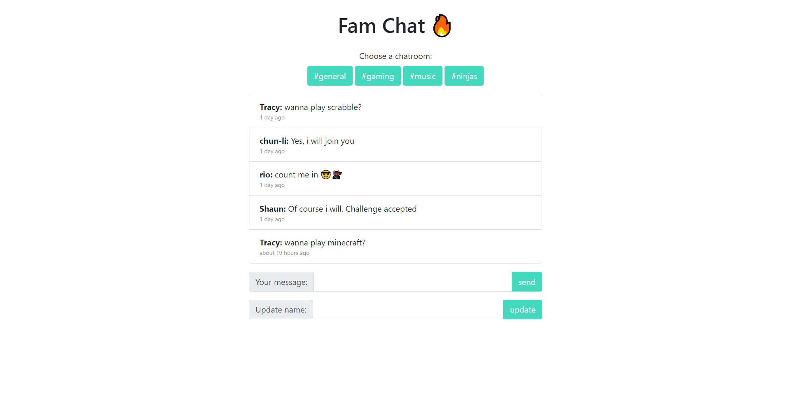

# chatroom-js

;

> This is a screenshot from the gaming room

---

## Description

This is a chat project where it has different rooms that people can use to communicate in.
This rooms are organized according to different topics like:
- General
- Gaming
- Music
- Ninja

#### Technologies

- HTML
- CSS
- VANILLA JAVASCRIPT
